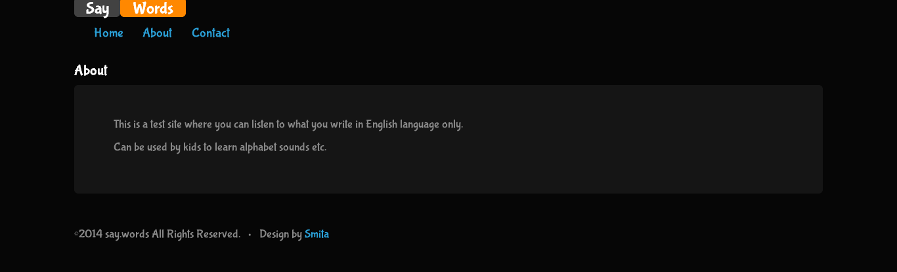
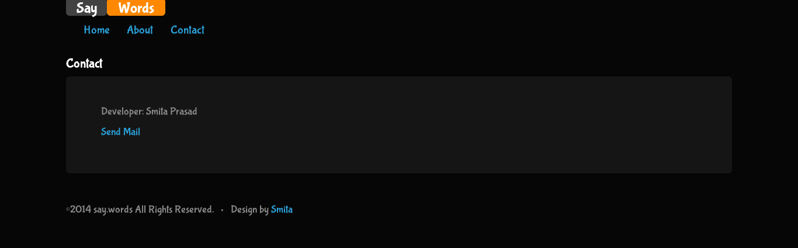

words
=====

This is a test site where you can listen to what you write in English language only. 
Can be used by kids to learn alphabet sounds etc.

This uses Apache Tapestry 5.3, JSAPI, freeTTS and Bootstrap.

Use your headphones to listen to whatever you write. :) 

 

 

